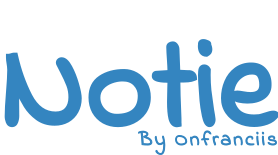

# Notie By Onfranciis

In this repository you will find the source code for the **Notie** web app.
This SPA leverages the browser's API by using the [localStorage](https://developer.mozilla.org/en-US/docs/Web/API/Window/localStorage) property in the window interface.

This is built using

- NextJs (A ReactJs Framework)
- Tailwind (A CSS Framework)
  _[Learn how](./LEARN.md)_

### Resources

- Indie Flower (Font)
- Figma (Design Tool)
- Netlify (Hosting)
- VS Code Insiders (IDE)

### Install Locally

To install this project locally

- Navigate to your working directory in your terminal and run `git clone https://github.com/onfranciis/notie`
- Navigate to **notie** and run

```
npm run dev
or
yarn dev
```

- Open [http://localhost:3000](http://localhost:3000) on your browser to see the project. You can also see this project live at [https://notie.onfranciis.dev](https://notie.onfranciis.dev)
  <br>
  For enquiries, support or more, contact [notie@onfranciis.dev](mailto:notie@onfranciis.dev)


    
